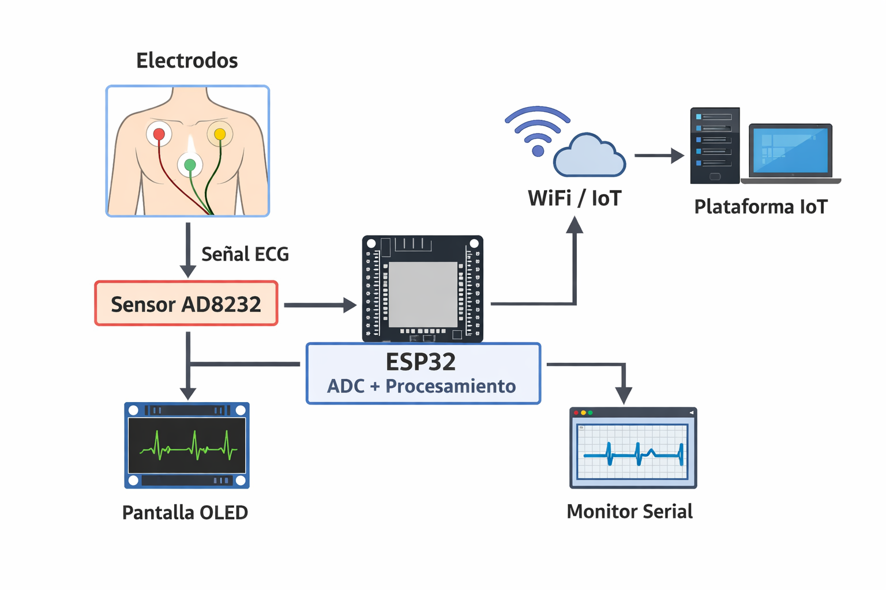

# 🫀 Holter IoT con ESP32 – Monitor ECG Portátil

Integrantes:
* Yuly Dayana Rodriguez 
* Jacobo Andres Pacheco 
* David Andres Casas 

## Visión del Proyecto

Este proyecto consiste en el desarrollo de un **monitor cardíaco tipo Holter de bajo costo**, utilizando una **ESP32 y el sensor AD8232**, capaz de capturar señales ECG en tiempo real y transmitirlas para su visualización y análisis.

### Problema que resuelve

En muchos contextos (zonas rurales, monitoreo ambulatorio o proyectos académicos), los dispositivos médicos como el Holter tradicional son:

- Costosos  (entre $500.000 COP hasta $1'500.000)
- Poco accesibles  
- Dependientes de infraestructura clínica  

Este sistema busca ofrecer una alternativa:

- Económica  (Aproximado en $100.000)
- Portátil  
- De fácil implementación  

### Usuarios objetivo

- Estudiantes de medicina e ingeniería biomédica  
- Profesionales de salud en entornos con recursos limitados  
- Pacientes que requieren monitoreo básico no invasivo  
- Proyectos de investigación en IoT y salud  

## Arquitectura y Restricciones

### Descripción de la arquitectura

El sistema se compone de los siguientes bloques:

1. **Captura de señal**
   - Sensor AD8232 conectado al paciente  
   - Electrodos que capturan la actividad eléctrica del corazón  

2. **Procesamiento**
   - ESP32 adquiere señal analógica (ADC)  
   - Filtrado básico de ruido  

3. **Visualización local**
   - Pantalla OLED muestra la señal ECG en tiempo real  

4. **Transmisión IoT**
   - ESP32 envía datos vía WiFi a plataforma IoT  

## Presupuesto del Proyecto

| Componente            | Cantidad | Precio Aproximado (COP) |
|---------------------|---------|--------------------------|
| ESP32               | 1       | 25,000                   |
| Sensor AD8232       | 1       | 25,000                   |
| Pantalla OLED       | 1       | 19,000                   |
| Cables / Protoboard | 1       | 12,000                   |
| Electrodos          | 1 set   | 10,000                   |
| **Total**           |         | **100,000 COP aprox.**   |

## Restricciones del Hardware

### ESP32

- RAM limitada (~520 KB SRAM)  
- ADC de 12 bits (precisión limitada frente a equipos médicos)  
- Posible ruido en lectura analógica  

### Energía

- Consumo moderado (~80–240 mA con WiFi activo)  
- Dependencia de batería externa para portabilidad  

### Comunicación

- Dependencia de red WiFi  
- Latencia en transmisión de datos  

### Almacenamiento

- Limitado (sin almacenamiento persistente avanzado)  
- Necesidad de enviar datos en tiempo real  

### Limitación médica

- No es un dispositivo certificado  
- Uso únicamente educativo/prototipo  

## Reporte del Spike

### Objetivo del Spike

Validar la viabilidad de:

- Captura de señal ECG con AD8232  
- Lectura mediante ADC de la ESP32  
- Visualización en OLED  
- Transmisión de datos vía IoT  

### Actividades realizadas

- Conexión del sensor AD8232 a la ESP32  
- Configuración del pin ADC (GPIO 34)  
- Lectura de señal analógica  
- Visualización en Serial Plotter  
- Integración con pantalla OLED  
- Envío de datos a plataforma IoT  

### Resultados obtenidos

-  Señal ECG detectada correctamente  
-  Visualización en tiempo real funcional  
-  Comunicación WiFi estable  
-  Latencia aceptable para monitoreo básico  

### Problemas encontrados

- Ruido en la señal (movimiento del paciente)  
- Interferencias eléctricas  
- Limitaciones del ADC de la ESP32  
- Necesidad de mejor filtrado  

### Conclusión del Spike

El proyecto es **técnicamente viable** con hardware de bajo costo.  
Se logra capturar y transmitir señal ECG básica, aunque se requieren mejoras en:

- Filtrado de señal  
- Precisión  
- Robustez del sistema  

## Próximos pasos

- Implementar filtrado digital avanzado  
- Almacenamiento de datos tipo histórico (simulación Holter real)  
- Mejora en consumo energético  
- Interfaz web o app para visualización  
- Integración con análisis de arritmias  
