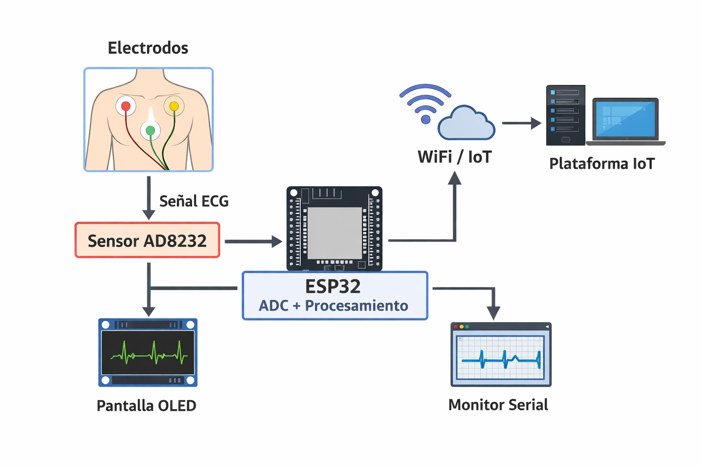
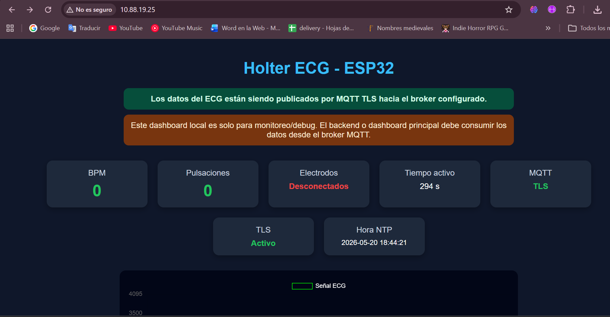
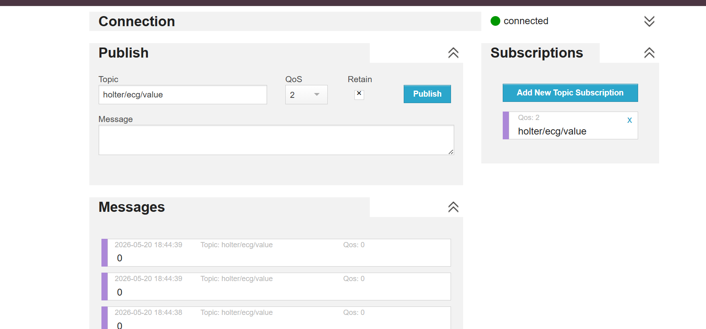
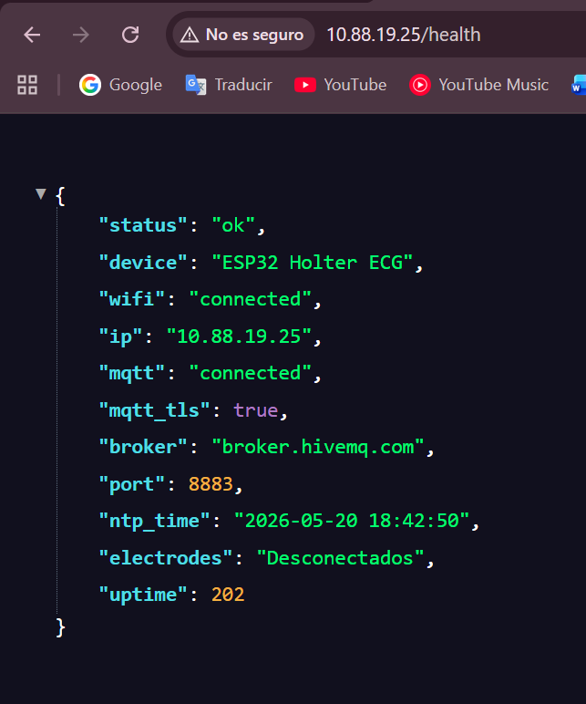
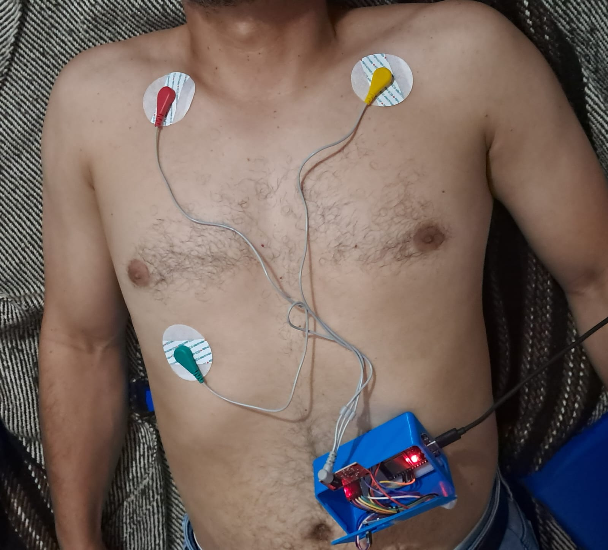
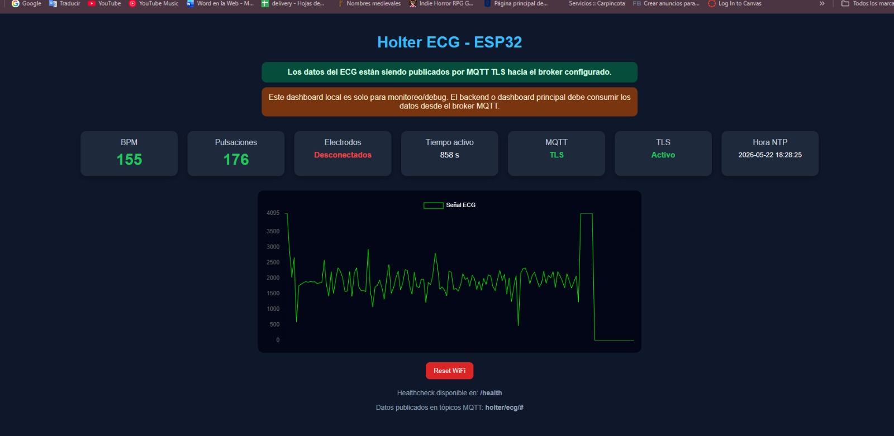

# Proyecto Final Holter IoT con ESP32 – Monitor ECG Portátil

Integrantes:
* Yuly Dayana Rodriguez 
* Jacobo Andres Pacheco 
* David Andres Casas 

Los archivos que comprueban de manera fotográfica las rúbricas del proyecto del **TERCER CORTE** (Sin mostrar el puerto 8883) estan el la carpeta de imgs
## Visión del Proyecto

Este proyecto consiste en el desarrollo de un **monitor cardíaco tipo Holter de bajo costo**, utilizando una **ESP32 y el sensor AD8232**, capaz de capturar señales ECG en tiempo real y transmitirlas para su visualización y análisis.

### Problema que resuelve

En muchos contextos (zonas rurales, monitoreo ambulatorio o proyectos académicos), los dispositivos médicos como el Holter tradicional son:

- Costosos  (entre $500.000 COP hasta $1'500.000)
- Poco accesibles  
- Dependientes de infraestructura clínica  

Este sistema busca ofrecer una alternativa:

- Económica  (Aproximado en $100.000)
- Portátil  
- De fácil implementación  

### Usuarios objetivo

- Estudiantes de medicina e ingeniería biomédica  
- Profesionales de salud en entornos con recursos limitados  
- Pacientes que requieren monitoreo básico no invasivo  
- Proyectos de investigación en IoT y salud  

## Arquitectura y Restricciones


# Conexiones del Hardware

## Conexión ESP32 ↔ AD8232

| AD8232 | ESP32 |
|---|---|
| OUTPUT | GPIO 34 |
| LO+ | GPIO 32 |
| LO- | GPIO 33 |
| 3.3V | 3.3V |
| GND | GND |

## Conexión ESP32 ↔ Pantalla OLED SSD1306

| OLED | ESP32 |
|---|---|
| VCC | 3.3V |
| GND | GND |
| SDA | GPIO 21 |
| SCL | GPIO 22 |

## Botón Reset WiFi

| Componente | ESP32 |
|---|---|
| Botón | GPIO 25 |

---

# Tecnologías Utilizadas

## Hardware

- ESP32   
- Sensor ECG AD8232  
- Pantalla OLED SSD1306 128x64  
- Electrodos ECG desechables  

## Software y Librerías

| Tecnología | Uso |
|---|---|
| Arduino IDE | Programación ESP32 |
| WiFiManager | Configuración dinámica WiFi |
| PubSubClient | Comunicación MQTT |
| WiFiClientSecure | Comunicación TLS |
| Adafruit SSD1306 | Control OLED |
| Chart.js | Visualización gráfica web |
| NTP | Sincronización de tiempo |

---

# Funcionalidades Implementadas

## Captura ECG en tiempo real

La ESP32 realiza lectura analógica continua desde el sensor AD8232 utilizando el ADC interno.

```cpp
ecgValue = analogRead(ECG_PIN);
```

---

## Detección básica de BPM

Se implementó un algoritmo simple basado en umbral para detectar latidos cardíacos.

```cpp
if (value > threshold && !aboveThreshold)
```

El sistema calcula:

- BPM aproximado  
- Conteo de pulsaciones  
- Tiempo entre latidos  

---

## Visualización en OLED

La señal ECG se dibuja en tiempo real en una pantalla OLED SSD1306.

### Características mostradas

- Señal ECG  
- BPM  
- Estado MQTT  
- Estado de electrodos  

---

## Dashboard Web Integrado

La ESP32 levanta un servidor web local mediante:

```cpp
WebServer server(80);
```

### Incluye

- Dashboard HTML embebido  
- Visualización ECG en Chart.js  
- Estado MQTT  
- Hora sincronizada por NTP  
- Estado de electrodos  
- Tiempo activo del dispositivo




---

# Comunicación MQTT con TLS

El sistema publica datos mediante MQTT usando conexión segura TLS.

## Broker MQTT

Actualmente se utiliza:

- Broker HiveMQ  
- Puerto seguro 8883  
- Cliente TLS  

```cpp
const int MQTT_PORT = 8883;
```



---

## Tópicos MQTT utilizados

| Tópico | Descripción |
|---|---|
| `holter/ecg/value` | Valor ECG instantáneo |
| `holter/ecg/bpm` | BPM calculado |
| `holter/ecg/beatCount` | Conteo de latidos |
| `holter/ecg/electrodes` | Estado electrodos |
| `holter/ecg/uptime` | Tiempo activo |
| `holter/ecg/timestamp` | Fecha y hora NTP |
| `holter/ecg/status` | Estado general |
| `holter/ecg/json` | Payload JSON completo |

---

# Seguridad Implementada

## TLS en MQTT

La comunicación MQTT utiliza TLS para cifrar la transmisión de datos.

```cpp
WiFiClientSecure secureClient;
```

Actualmente:

```cpp
secureClient.setInsecure();
```

Esto habilita TLS pero sin validación estricta de certificado.

Como mejora futura se propone:

```cpp
secureClient.setCACert(root_ca);
```

para autenticación completa del broker.

---

# Sincronización Horaria NTP

El sistema sincroniza automáticamente la hora usando NTP.

## Servidor utilizado

```text
pool.ntp.org
```

### La hora sincronizada se utiliza para:

- Timestamp MQTT  
- Dashboard web  
- Eventos de monitoreo  

### Formato

```text
YYYY-MM-DD HH:MM:SS
```

---

#  Detección de Electrodos

El sistema verifica si los electrodos están correctamente conectados mediante:

```text
LO+
LO-
```

Si un electrodo se desconecta:

- Se detiene la lectura ECG  
- La OLED muestra alerta  
- El dashboard indica estado incorrecto  

---

# Healthcheck del Sistema

Se implementó un endpoint REST para verificar estado del dispositivo.

## Endpoint

```http
GET /health
```

## Respuesta JSON

```json
{
  "status":"ok",
  "device":"ESP32 Holter ECG",
  "wifi":"connected",
  "mqtt":"connected",
  "mqtt_tls":true
}
```


---

# Configuración WiFi Dinámica

El proyecto utiliza WiFiManager para evitar hardcodear credenciales.

## Funcionamiento

Si la ESP32 no encuentra WiFi:

1. Crea un Access Point:

```text
Holter-ECG
```

2. El usuario se conecta  
3. Configura SSID y contraseña desde navegador  
4. La ESP32 guarda credenciales automáticamente  

---

# Reset de WiFi

El sistema permite borrar configuraciones WiFi mediante:

- Botón físico GPIO 25  
- Endpoint HTTP  

```http
POST /reset-wifi
```

---

# Flujo General del Sistema

```text
Electrodos
   ↓
AD8232
   ↓
ESP32 ADC
   ↓
Procesamiento BPM
   ↓
OLED + Dashboard Web
   ↓
MQTT TLS
   ↓
Broker IoT
```

---

# Validaciones Realizadas

## Pruebas funcionales

-  Lectura ECG estable  
-  Detección BPM  
-  Visualización OLED  
-  Dashboard funcional  
-  Conexión MQTT  
-  Sincronización NTP  
-  Healthcheck operativo  
-  Reconexión MQTT automática  
-  Reconexión WiFi dinámica  

---

# Mejoras Futuras

## Procesamiento de señal

- Filtro pasa banda digital  
- Eliminación de ruido 60 Hz  
- Filtro notch  

## Inteligencia médica

- Detección de arritmias  
- Detección de fibrilación auricular  
- Alertas automáticas  

## Infraestructura IoT

- Backend persistente  
- Base de datos histórica  
- Dashboard cloud  
- App móvil  

## Seguridad

- Validación CA TLS  
- Autenticación MQTT  
- Tokens JWT  

---

# Conceptos de Ingeniería Aplicados

## IoT

- Sensores biomédicos  
- Comunicación inalámbrica  
- Publicación MQTT  

## Sistemas Embebidos

- ADC ESP32  
- Gestión de memoria  
- Tiempo real básico  

## Redes

- MQTT  
- TLS  
- HTTP REST  
- WiFi  

## Salud Digital

- Telemetría biomédica  
- Monitoreo remoto  
- Dispositivos wearables  

---

# Advertencia Médica

> Este proyecto es únicamente educativo y de investigación.  
> No reemplaza dispositivos médicos certificados ni debe utilizarse para diagnóstico clínico real.

---

# Evidencias

Las evidencias fotográficas y pruebas de cumplimiento de rúbricas del tercer corte se encuentran en:





## Video de demostración

https://youtube.com/shorts/cSvOMIurHtk?si=10aOJ-HlRb1GqgEK

## Archivos de Evidencia

| Archivo | Descripción |
|---|---|
| `CONECT.png` | Evidencia de conexión y funcionamiento general del sistema |
| `ENDPOINT_HEALCHECK.png` | Prueba del endpoint `/health` mostrando estado operativo del dispositivo |
| `MQTT_SINELECTRODOS.png` | Evidencia del funcionamiento MQTT cuando los electrodos no están conectados |
| `PROTOCOLO_NTP.png` | Evidencia de sincronización horaria mediante protocolo NTP |

## Evidencias Incluyen

- Conexiones hardware  
- Dashboard funcionando  
- Visualización OLED  
- MQTT operativo  
- Pruebas del sistema  
- Healthcheck  
- Configuración WiFi  
